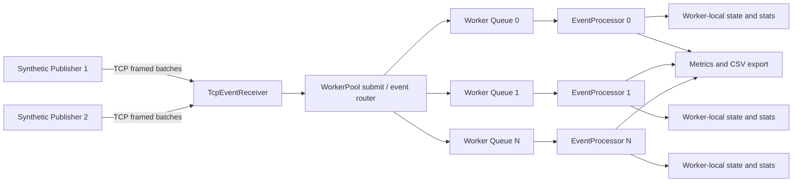

# Architecture

This project is organized around three clear boundaries:

- `market_data_publisher`: generates synthetic market data and sends framed batches over TCP.
- `market_data_processor`: receives batches, decodes them, routes events to worker queues, processes them, and exports runtime metrics.
- `mdp_protocol`: shared framing and protocol definitions used by both sides.

## High-Level Diagram



## Component Breakdown

### Publisher

The publisher executable lives under `publisher/`.

Responsibilities:

- load `publisher/config/publisher.ini`
- generate events from a pluggable source interface
- support `synthetic/SyntheticPublisherSource` for local benchmarks
- support `ibkr/IbkrMarketDataSource` for IBKR snapshot polling or websocket streaming
- resolve configured IBKR symbols to conids through `/iserver/secdef/search` before subscribing or polling
- encode events into `MarketDataEventFrame`
- connect to the processor over TCP
- send `ClientHello`
- send `EventBatch` messages
- pipeline ACK waits via `ack_window_batches`
- flush outstanding ACKs before shutdown
- emit interval CSV metrics when enabled

The publisher is intentionally simple: source-specific logic stays behind `IPublisherSource`, while batching, framing, ACK handling, and TCP transmission remain shared.

### Shared Protocol Library

The shared protocol library lives under `lib/protocol/`.

Responsibilities:

- define the wire-level event frame
- encode `MarketDataEvent` into `MarketDataEventFrame`
- decode `MarketDataEventFrame` back into `MarketDataEvent`
- define shared port-protocol structures such as `MessageHeader`, `ClientHello`, `ServerHello`, `EventBatch`, `Ack`, and `Reject`

This keeps protocol ownership in one place instead of duplicating serialization logic between publisher and processor.

### TCP Event Receiver

The processor-side receiver lives under `src/network/`.

Responsibilities:

- listen for publisher connections
- enforce `max_connections`
- perform the hello/handshake exchange
- receive framed messages
- validate message headers and batch payload sizing
- decode event frames
- stamp batch ingest time
- submit decoded events into the worker pool
- send ACKs with accepted event counts

The receiver is intentionally aggregate-oriented: it reads a whole batch, decodes frames, and then feeds the worker pool event by event.

### WorkerPool and Queues

The worker pool lives under `src/pipeline/`.

Responsibilities:

- choose a worker partition for each event
- enqueue events into bounded per-worker queues
- run worker threads
- expose queue metrics, processed counts, latency summaries, and snapshot accessors

Each partition owns:

- one queue
- one `EventProcessor`
- one accepted-count counter

### EventProcessor

The hot-path processing logic lives under `src/processing/`.

Responsibilities:

- validate event fields
- enforce per-symbol sequence policy
- identify duplicates, gaps, and out-of-order events
- evaluate simple risk rules
- update worker-local symbol state
- update worker-local symbol statistics
- record processing latency and queue-wait latency
- optionally publish processed-event CSV rows

## Runtime Data Flow

The runtime flow is:

1. the processor starts listening on `network.listen_address:network.listen_port`
2. one or more publishers connect
3. each publisher sends `ClientHello`
4. the processor replies with `ServerHello`
5. the publisher sends framed `EventBatch` messages
6. the receiver validates the header and payload
7. each frame is decoded into `MarketDataEvent`
8. the event is stamped with batch ingest time
9. `WorkerPool::submit` hashes the symbol to a worker partition
10. the event enters that worker's bounded queue
11. the worker thread pops the event and runs `EventProcessor::process`
12. metrics and optional CSV exports are updated
13. the processor ACKs the batch back to the publisher

## Threading and Concurrency Model

The current concurrency model is straightforward and explainable:

- one accept/listen thread in `TcpEventReceiver`
- one session thread per connected publisher
- one worker thread per worker partition

That means concurrency exists at two levels:

- network/session concurrency across publishers
- event-processing concurrency across worker partitions

Same-symbol ordering is preserved because all events for a given symbol hash to the same worker queue.

## Queueing and Backpressure Model

Each worker has its own bounded queue.

Important properties:

- queue capacity is explicit and configurable
- queue policy is configurable (`blocking_bounded` or `lock_free_ring`)
- when the queue is full, behavior is governed by the configured full-policy
- the processor keeps counters for accepted, rejected, dropped, and failed-enqueue events

This makes overload visible instead of silently letting memory growth absorb pressure.

The publisher also uses ACK windowing. It can have multiple in-flight batches before waiting for ACKs, which improves throughput without making the wire protocol complex.

## Symbol Routing Model

Routing is deterministic:

```text
hash(symbol) % worker_count
```

This model was chosen for clarity and correctness:

- same-symbol events always hit the same worker
- state ownership stays local
- ordering is preserved per symbol
- there is no central lock around symbol state

The tradeoff is possible skew if symbol activity is uneven.

## State Ownership Model

Each `EventProcessor` owns its own:

- `SequenceTracker`
- `SymbolStateStore`
- `SymbolStats`
- latency recorders
- processing counters

This worker-local ownership keeps updates simple. The processor does not need a shared concurrent map for hot-path symbol state. End-of-run summaries and CSV snapshots are assembled by merging worker-local snapshots.

## Metrics and Export Flow

The metrics path has two layers.

### Live runtime metrics

The processor prints periodic summaries that include:

- received/sec
- processed/sec
- rejected/sec
- queue depth
- queue saturation signals

The publisher prints generated, encoded, and accepted counts plus encode throughput.

### CSV export

When enabled, the processor writes:

- `processor-metrics.csv`: interval-level throughput, queue, validation, and latency metrics
- `symbol-stats.csv`: end-of-run aggregated symbol statistics and last observed state
- `processed-events.csv`: optional event history output

When enabled, the publisher writes:

- `publisher-metrics.csv`: interval-level generated, encoded, accepted, and encode-failure metrics

The run scripts place these files under `results\run_<timestamp>\`.

## Design Summary

The architecture is intentionally conservative:

- explicit network boundary
- shared protocol library
- deterministic routing
- bounded queues
- worker-local state
- observable runtime counters and artifacts

That makes the project easier to explain, benchmark, and evolve than a more abstract or over-generalized design.
